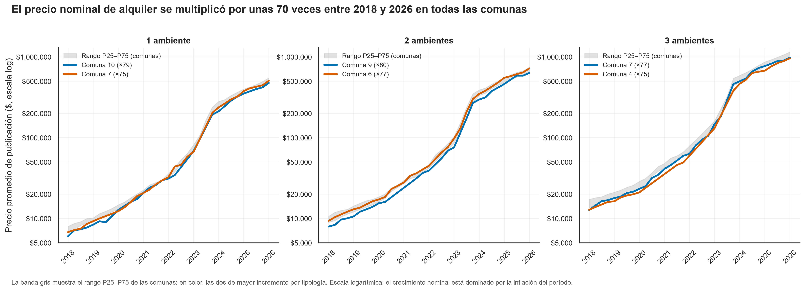
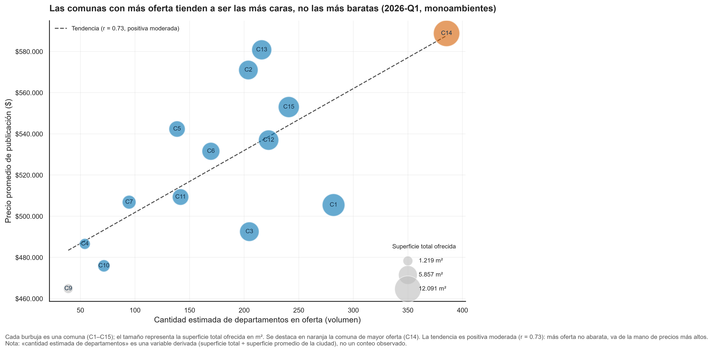
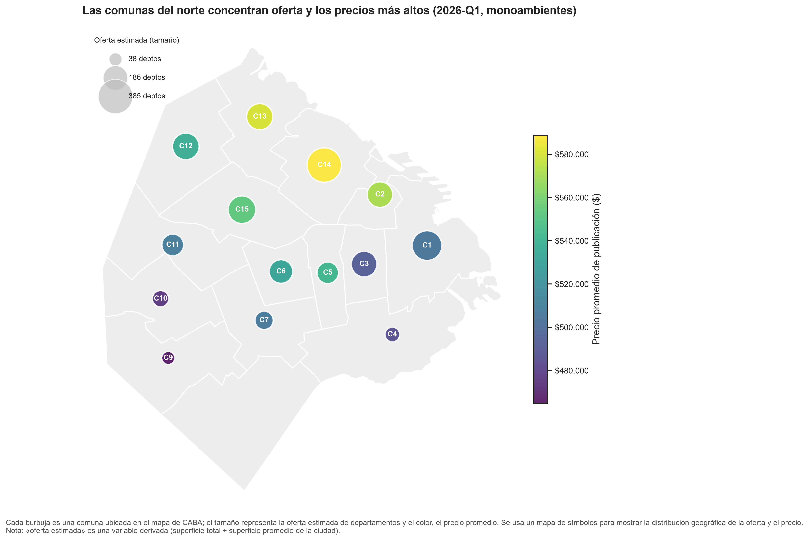
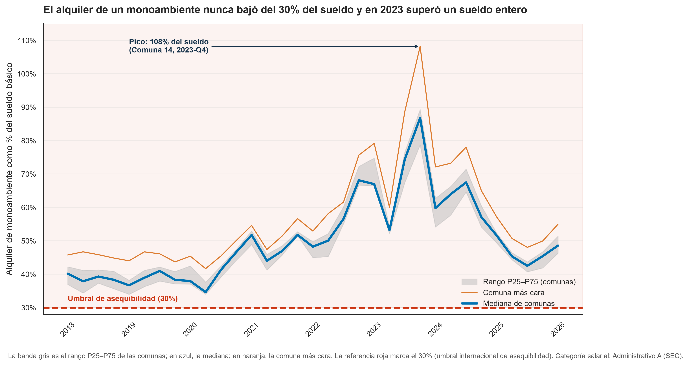

# Visualizaciones diseñadas

Se diseñaron cuatro gráficos en Python con matplotlib (usando seaborn solo para el estilo base) a partir del dataset maestro, uno por cada pregunta de análisis. Cada uno aplica principios de visualización efectiva (tipo de gráfico adecuado, título de acción, paleta apta para daltónicos) y el código que los genera es reproducible.

## Gráfico 1
Responde a la Pregunta 1 (¿Cómo evolucionó el precio promedio de publicación de alquiler entre 2018 y 2026 según comuna y cantidad de ambientes?).

## Gráfico 2
Responde a la Pregunta 2, específicamente a la parte "¿cómo se relaciona el volumen estimado de departamentos con el nivel de precios?", cuantificando esa relación mediante el coeficiente de correlación (r = 0.73).

## Gráfico 3
Responde a la Pregunta 3 (¿Qué proporción del sueldo básico representa el alquiler según comuna y trimestre, y qué comunas superan el umbral de referencia del 30%?).

## Gráfico 4
Responde a la Pregunta 4 (¿Qué proporción del sueldo básico representa el alquiler según comuna y trimestre, y qué comunas superan el umbral de referencia del 30%?).

